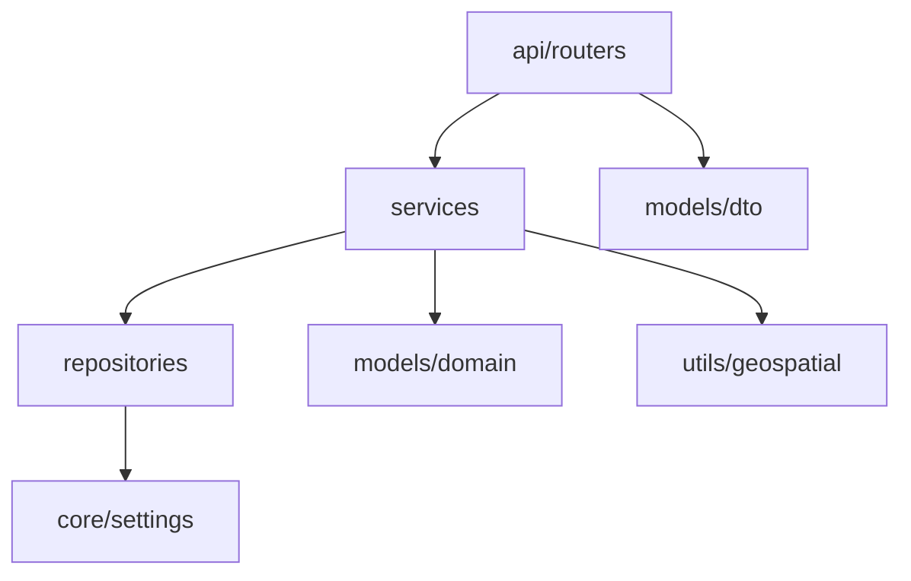

# Nearest Grit Bin API

FastAPI backend that resolves an address within a UK postcode and returns the nearest Derbyshire County Council grit bin within 100 metres.

**Hands-on lab (rebuild by typing each file):** see [`tutorial/README.md`](tutorial/README.md).

**Sources & domain background** (postcodes, grit bins, GeoServer, docs used):  
[`tutorial/09-sources-and-references.md`](tutorial/09-sources-and-references.md).

**Example request shape:** `address=Example%20Building`, `postcode=AB12 3CD` — any
real postcode/address pair is accepted dynamically.

---

## Architecture

```
src/
  main.py                         # Process entry (uvicorn runner)
  app.py                          # FastAPI factory + middleware/handlers
  config.py                       # Re-exports Settings / get_settings
  core/
    settings.py                   # Env-driven Settings (pydantic-settings)
    logging.py                    # Logging setup
  api/
    routers/
      address.py                  # /health, /
      gritbins.py                 # GET /nearest-grit-bin
    dependencies/                 # DI: settings, httpx, services
  services/
    address_service.py            # Address matching / resolve (no FastAPI)
    gritbin_service.py            # Nearest-bin orchestration (no FastAPI)
  repositories/
    address_repository.py         # Address Lookup API HTTP
    gritbin_repository.py         # GeoServer WFS HTTP
  models/
    dto/                          # Pydantic request/response models
    domain/                       # Point27700, ResolvedAddress, GritBinMatch
  utils/
    geospatial.py                 # CRS, distance, nearest_from_features
    exceptions.py                 # Typed domain exceptions
tests/                            # Unit + API tests (httpx/respx mocked)
```

**Layering**

| Layer | Responsibility |
|-------|----------------|
| `api/routers` | HTTP only — validate params, call services, map DTOs |
| `services` | Business rules — no FastAPI imports |
| `repositories` | External I/O (Address API, GeoServer) |
| `models` | DTOs at the edge; domain objects inside |
| `utils` | Pure helpers (geospatial, exceptions) |
| `core` | Settings + logging |



**Request flow**

1. Router validates `postcode` and `address` query params  
2. `AddressService` → `AddressRepository` fetches postcode records  
3. Match the record whose title/parts contain `address` (case-insensitive)  
4. Normalise coordinates to **EPSG:27700** (BNG)  
5. `GritBinService` → `GritBinRepository` queries WFS with `DWITHIN`  
6. If DWITHIN fails or returns empty → fetch features and pick nearest by planar Euclidean distance  
7. Return JSON DTO with title + distance  

---

## Prerequisites

- Python 3.11+
- A `.env` file (see `.env.example`)

---

## Environment variables

| Variable | Purpose |
|---|---|
| `ADDRESS_API_BASE_URL` | Base URL for the Address Lookup API |
| `ADDRESS_API_ALIAS` | Value for the `x-alias` header |
| `ADDRESS_API_AUTH_TOKEN` | Value for the `x-auth-token` header |
| `GEOSERVER_BASE_URL` | GeoServer root (WFS path is `{base}/DCC/ows`) |
| `GEOSERVER_LAYER` | WFS typeName, e.g. `DCC:Gritbins` |
| `NEAREST_SEARCH_RADIUS_METERS` | Search radius (default `100`) |
| `HTTP_TIMEOUT_SECONDS` | Upstream HTTP timeout (default `30`) |

Copy the example and fill in real values:

```bash
cp .env.example .env
```

---

## Run locally

```bash
# From the repository root
python -m venv .venv

# Windows PowerShell
.\.venv\Scripts\Activate.ps1

# macOS / Linux
# source .venv/bin/activate

pip install -r requirements.txt
uvicorn src.app:app --reload --host 0.0.0.0 --port 8000
```

Open interactive docs: [http://127.0.0.1:8000/docs](http://127.0.0.1:8000/docs)

### Example request

```bash
curl "http://127.0.0.1:8000/nearest-grit-bin?postcode=AB12%203CD&address=Example%20Building"
```

### Example success response

```json
{
  "address": "Example Building",
  "postcode": "AB12 3CD",
  "nearest_grit_bin_title": "GB0001",
  "distance_meters": 42.5
}
```

### Example error response

```json
{
  "error": {
    "code": "target_address_not_found",
    "message": "Address 'Example Building' was not found within postcode 'AB12 3CD'."
  }
}
```

| HTTP | `error.code` | When |
|---|---|---|
| 400 | `missing_parameter` | Missing `postcode` or `address` |
| 400 | `invalid_postcode` | Postcode fails UK format checks, or Address API rejects it as invalid |
| 404 | `address_not_found` | Postcode returned no addresses |
| 404 | `target_address_not_found` | Title did not match |
| 404 | `no_grit_bin_nearby` | Nothing within the radius |
| 502 | `address_api_unreachable` | Address API down / 5xx |
| 502 | `geoserver_unreachable` | GeoServer down / 5xx |
| 502 | `unexpected_schema` | Upstream JSON shape unexpected |

---

## Tests

```bash
pytest -v
```

All upstream HTTP calls are mocked with **respx** — tests do not need live credentials.

---

## Docker

Starts **both** the FastAPI backend (`:8000`) and the Next.js frontend (`:3000`):

```bash
docker compose up --build
```

| Service | URL |
|---|---|
| Frontend (test UI) | http://127.0.0.1:3000 |
| Backend API | http://127.0.0.1:8000 |
| API docs | http://127.0.0.1:8000/docs |

The frontend container talks to the backend over the Compose network
(`BACKEND_URL=http://backend:8000`). Secrets still come from the root `.env`
(backend only).

Backend only:

```bash
docker compose up --build backend
# or
docker build -t nearest-grit-bin-backend .
docker run --rm -p 8000:8000 --env-file .env nearest-grit-bin-backend
```

Local/dev installs:

```bash
pip install -r requirements-dev.txt   # runtime + pytest
```

---

## Frontend (Next.js test UI)

A small App Router UI lives in `frontend/`. The browser calls
`/api/nearest-grit-bin`, which proxies to FastAPI — upstream Derbyshire APIs are
never hit from client-side JavaScript (CORS-safe).

**Preferred:** `docker compose up --build` (see Docker above).

Local Node (against a backend on `:8000`):

```bash
cd frontend
cp .env.example .env.local   # BACKEND_URL=http://127.0.0.1:8000
npm install
npm run dev
```

Open [http://127.0.0.1:3000](http://127.0.0.1:3000). Placeholders show the
example shape (`Example Building` / `AB12 3CD`); enter a real Derbyshire
postcode and address hint to query live data.

---

## Design decisions

1. **Config via pydantic-settings** — required env keys fail fast at startup; headers are built once from Settings, never scattered as literals.
2. **Shared `httpx.AsyncClient`** — connection pooling across Address + GeoServer calls in a single request.
3. **Flexible address schema parsing** — field aliases (`Title`/`FullAddress`, `Easting`/`X_COORDINATE`, nested `location`) tolerate council API variance without hard-coding one DTO.
4. **Always normalise to EPSG:27700** — grit-bin geometries are BNG; DWITHIN metres and Euclidean metres are then meaningful. (`Point27700` / `Point4326` name the CRS in the type; see `utils/geospatial.py`.)
5. **DWITHIN first, Euclidean fallback** — e.g. `DWITHIN(SP_GEOMETRY, POINT(e n), 100, meters)` on GeoServer; if that fails/empties, fetch features and rank with `math.hypot` on BNG metres.
6. **Typed `AppError` hierarchy** — one exception handler maps domain failures to stable JSON error codes for clients and interview demos.

Spatial beginner FAQ: [tutorial/10-spatial-querying.md](tutorial/10-spatial-querying.md#beginner-faq--crs-bng-and-this-codebase).

---

## Interview notes

Interview write-ups live in **[`docs/`](docs/README.md)**:

**Brief checklist:** [docs/requirements-coverage.md](docs/requirements-coverage.md)

**Deliverable write-up**

- [Approach](docs/approach.md)
- [Assumptions](docs/assumptions.md)
- [Issues encountered](docs/issues-encountered.md)
- [Investigation notes](docs/investigation-notes.md)
- [Improvements with more time](docs/improvements.md)
- [Deploy / reuse](docs/deploy.md)

**Follow-up discussion**

- [Scale to multiple asset types](docs/scale-multiple-asset-types.md)
- [Return nearest 5 grit bins](docs/nearest-5-grit-bins.md)
- [Available to other Solutions](docs/available-to-other-solutions.md)
- [Batch-process addresses](docs/batch-process-addresses.md)
- [Test and monitor in production](docs/test-and-monitor.md)

---

## License

Interview / technical-exercise code — not for production use without hardening (authn on *this* API, caching, SLA handling for upstreams).
