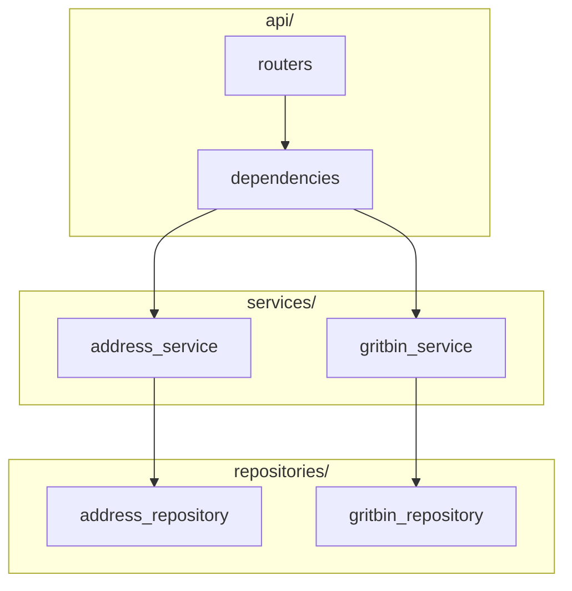

# Approach

I treated the exercise as an **integration pipeline** with clearly separated stages:

```
validate params → geocode address → reproject to BNG → spatial query → rank → respond
```


## Layered backend



Design principles applied:

- **Thin HTTP layer** (`api/routers` + `app.py`): parameter validation, dependency
  wiring, and mapping domain errors to HTTP/JSON. No business logic.
- **Business rules in services** (`address_service.py`, `gritbin_service.py`): no
  FastAPI imports; orchestrate matching and DWITHIN fallback.
- **I/O isolated in repositories**: each external system has one client that knows
  its schema quirks and failure modes.
- **Pure helpers in utils** (`geospatial.py`): reprojection and distance math are
  side-effect free and unit-tested in isolation.
- **Domain vs DTO**: internal dataclasses in `models/domain/`; Pydantic wire models
  in `models/dto/`.
- **Config from environment only** (`core/settings.py`): all URLs, headers and
  tuning values come from `.env` via `pydantic-settings`; nothing is hard-coded.
- **WFS over WMS**: WMS renders map *images*; WFS returns *feature geometry and
  attributes*, which is what we need for distance calculation and titles.
- **Preferred server-side spatial filter, with a client-side fallback** so the
  service still works if the GeoServer instance disables CQL spatial predicates.

## Coordinate systems (CRS) — short primer

**CRS** = Coordinate Reference System (what the numbers mean).

| Code | Name | Units | Use here |
|------|------|-------|----------|
| EPSG:27700 | British National Grid | metres (easting, northing) | Grit-bin layer; all distance maths |
| EPSG:4326 | WGS84 | degrees (lon, lat) | GPS / some address payloads — convert first |

Domain types `Point27700` / `Point4326` are named after those EPSG codes so the
CRS is obvious in code. Helpers live in `src/utils/geospatial.py`.

Distance after normalisation to BNG:

1. **DWITHIN** — GeoServer keeps features within N metres, e.g.
   `DWITHIN(SP_GEOMETRY, POINT(443563 360212), 100, meters)`.
2. **Euclidean** — Python `math.hypot(Δe, Δn)` for ranking / fallback.

Longer beginner FAQ: [tutorial/10-spatial-querying.md](../tutorial/10-spatial-querying.md).
