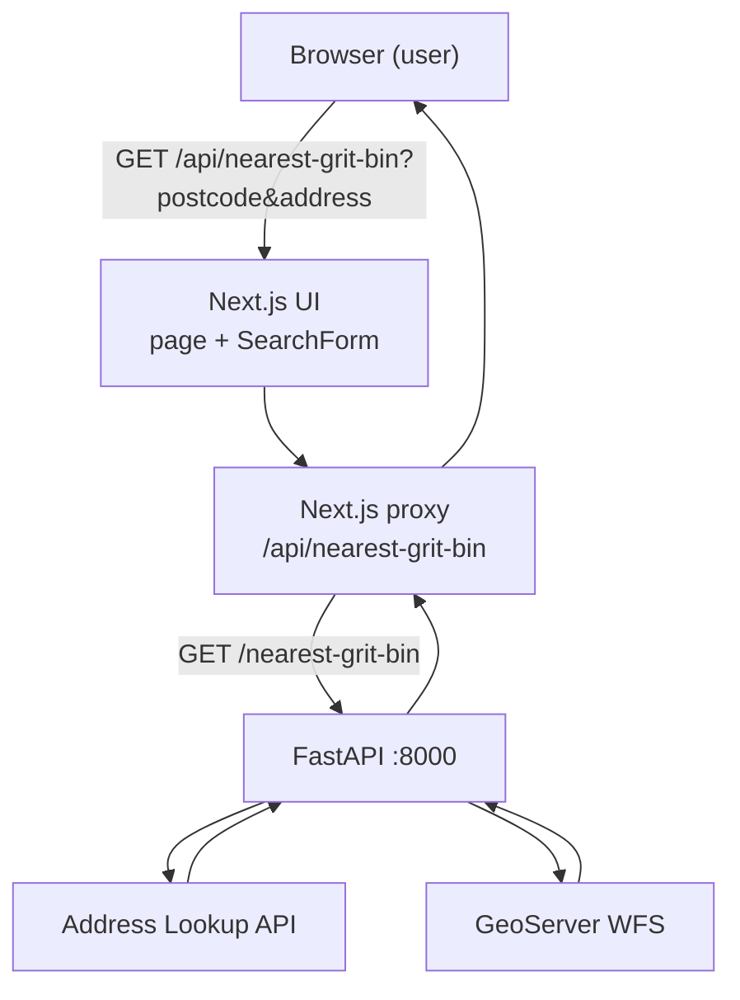
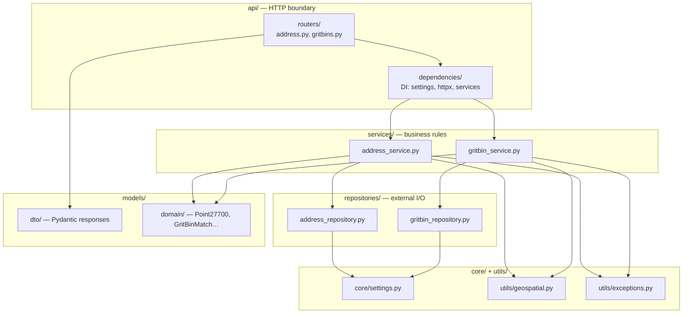
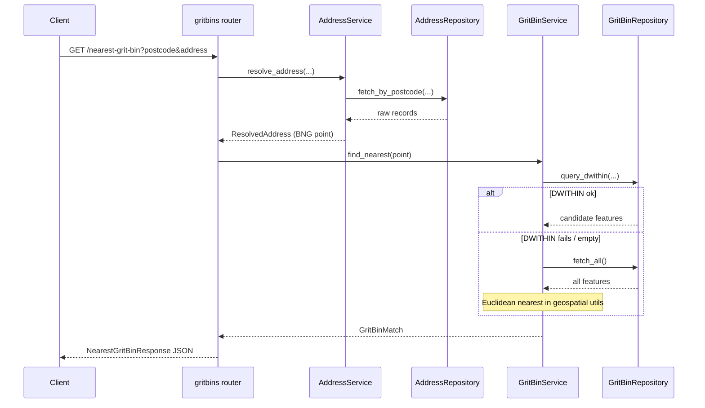

# 2. Architecture Overview

## What you will do

Understand the data flow and the **backend layered design**. No coding yet.

## Responsibilities

### Backend (FastAPI)

- Accept `postcode` and `address` query params
- Call the Address Lookup API
- Match the address and normalise coordinates to **EPSG:27700** (British National Grid)
- Query GeoServer WFS for the nearest grit bin
- Return JSON success or a typed JSON error

### Frontend (Next.js)

- Render the search form
- Call its **own** `/api/nearest-grit-bin` route (same origin)
- That route (server-side) forwards to FastAPI
- Show the result or a friendly error

## Fullstack data flow

## Why the proxy exists

1. **Secrets stay on the server** (Address API token never reaches the browser)
2. **No CORS pain** — the browser only talks to Next.js on the same origin
3. **Clean separation** — UI talks to `/api/…`; FastAPI talks to Derbyshire systems

## Backend layered design

The backend is split so each layer has **one job**. Routers never call GeoServer
directly; services never import FastAPI; repositories own all upstream HTTP.

### Request path inside FastAPI

### Layer rules (memorise these)

| Layer | May do | Must not do |
|-------|--------|-------------|
| **Routers** | Parse query params, call services, return DTOs | Call GeoServer / Address API, do CRS maths |
| **Services** | Match addresses, orchestrate DWITHIN fallback | Import FastAPI, build HTTP responses |
| **Repositories** | httpx calls, parse upstream envelopes | Business ranking / “nearest” decisions |
| **Domain / utils** | Points, distance, exceptions | Know about HTTP status codes on routers |

Deep dive before you type the backend:

→ [backend/00-backend-design.md](./backend/00-backend-design.md)

---

<!-- tutorial-nav -->

| Previous | Next |
|:---------|-----:|
| ← [Sources and references](./09-sources-and-references.md) | [Folder structure](./03-folder-structure.md) → |
