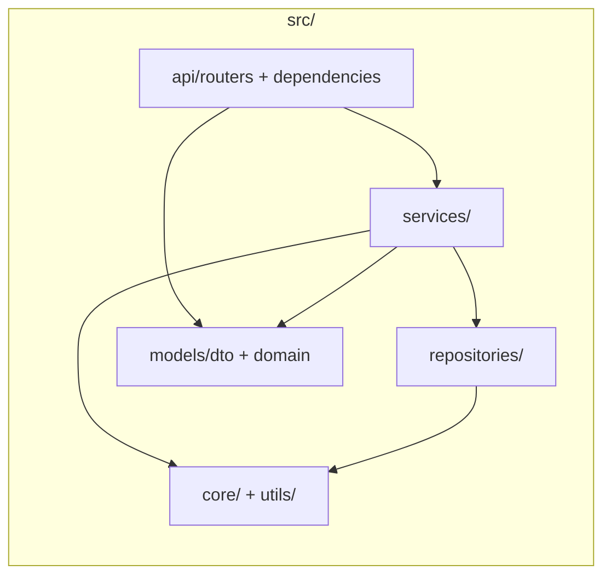

# 3. Folder Structure

## What you will do

Learn where each file belongs. You will create these folders and files with
**PowerShell** (`New-Item`) in the backend and frontend labs, then type the
contents yourself.

## Target tree (what you are building)

```
homelab/                          ← your project root
├── .env                          ← secrets (never commit)
├── .env.example
├── requirements.txt
├── requirements-dev.txt
├── Dockerfile
├── .dockerignore
├── docker-compose.yml
├── src/                          ← FastAPI backend (layered)
│   ├── main.py                   ← process entry
│   ├── app.py                    ← create_app()
│   ├── config.py                 ← re-exports settings
│   ├── core/
│   │   ├── settings.py
│   │   └── logging.py
│   ├── api/
│   │   ├── routers/
│   │   │   ├── address.py
│   │   │   └── gritbins.py
│   │   └── dependencies/
│   ├── services/
│   │   ├── address_service.py
│   │   └── gritbin_service.py
│   ├── repositories/
│   │   ├── address_repository.py
│   │   └── gritbin_repository.py
│   ├── models/
│   │   ├── dto/
│   │   └── domain/
│   └── utils/
│       ├── geospatial.py
│       └── exceptions.py
└── frontend/                     ← Next.js frontend
    ├── Dockerfile
    ├── .dockerignore
    ├── package.json
    ├── next.config.ts
    ├── tsconfig.json
    ├── .env.local
    ├── app/
    │   ├── layout.tsx
    │   ├── page.tsx
    │   ├── globals.css
    │   └── api/nearest-grit-bin/route.ts
    ├── components/
    │   └── SearchForm.tsx
    └── lib/
        └── types.ts
```

## Backend layers (where code goes)



## What each area means

| Path | Purpose |
|------|---------|
| `src/main.py` | Start uvicorn only |
| `src/app.py` | Assemble FastAPI app, lifespan, error handler |
| `src/core/settings.py` | Load and validate env vars |
| `src/api/routers/*` | HTTP endpoints (no upstream I/O) |
| `src/api/dependencies/` | Inject settings, httpx client, services |
| `src/services/*` | Business logic (no FastAPI imports) |
| `src/repositories/*` | Address API + GeoServer HTTP |
| `src/models/dto/*` | Pydantic response models |
| `src/models/domain/*` | Internal points / matches |
| `src/utils/geospatial.py` | CRS + distance + nearest-feature helper |
| `src/utils/exceptions.py` | Typed domain errors |
| `frontend/app/*` | Pages, layout, API route |
| `frontend/components/*` | Interactive UI (`SearchForm`) |
| `frontend/lib/types.ts` | TypeScript shapes matching the API |

Design rationale: [02-architecture.md](./02-architecture.md) and
[backend/00-backend-design.md](./backend/00-backend-design.md).

---

<!-- tutorial-nav -->

| Previous | Next |
|:---------|-----:|
| ← [Architecture](./02-architecture.md) | [Environment variables](./04-environment-variables.md) → |
