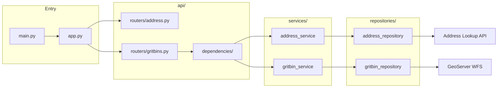
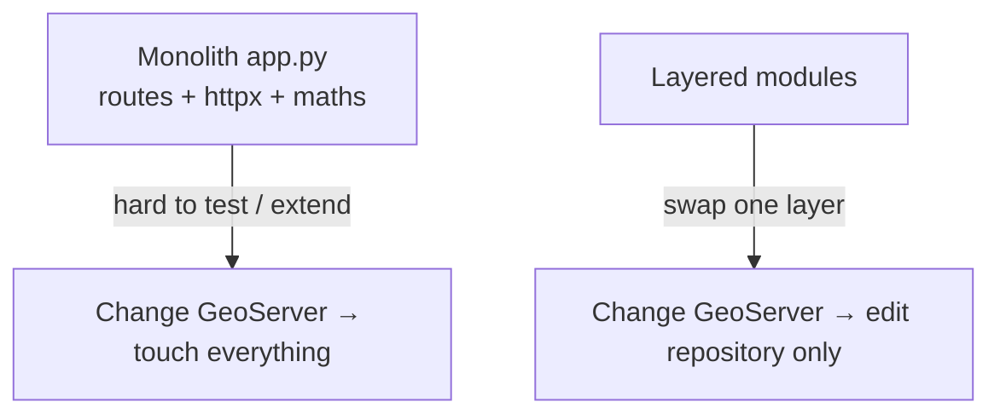

# Backend design — layered FastAPI architecture

## What you will do

Read this page before typing backend files. It explains **why** the folders exist
and how a request moves through them. No coding yet.

## Target layout

```
src/
  main.py                 # starts uvicorn only
  app.py                  # create_app(), lifespan, exception handler
  config.py               # re-exports Settings / get_settings
  core/
    settings.py           # pydantic-settings from .env
    logging.py
  api/
    routers/
      address.py          # /health, /
      gritbins.py         # /nearest-grit-bin
    dependencies/         # Depends(...) providers
  services/
    address_service.py
    gritbin_service.py
  repositories/
    address_repository.py
    gritbin_repository.py
  models/
    dto/                  # Pydantic API models
    domain/               # dataclasses (Point27700, …)
  utils/
    geospatial.py
    exceptions.py
```

## Component diagram



## Single-responsibility map

| Module | Single job |
|--------|------------|
| `core/settings.py` | Load and validate env |
| `utils/exceptions.py` | Typed errors with `code` + `status_code` |
| `utils/geospatial.py` | CRS convert, Euclidean distance, nearest-feature pick |
| `models/domain/*` | Internal entities / value objects |
| `models/dto/*` | Wire JSON shapes for OpenAPI |
| `repositories/*` | Talk to one external system |
| `services/*` | Business rules for one domain |
| `api/routers/*` | HTTP for one domain |
| `api/dependencies/` | Wire settings + shared `httpx` client into services |
| `app.py` | Assemble routers, lifespan, error handler |
| `main.py` | Run the process |

## Why this beats a single `app.py`



- **Maintainability** — find grit-bin logic in one service file  
- **Modularity** — add `GET /nearest-5` without rewriting Address HTTP  
- **Testability** — mock a repository; unit-test services without FastAPI  
- **Scalability** — new asset types → new repository + service + router  

## How you will type it (lab order)

You still **type** every file. The backend lab builds bottom-up:

1. Packages + settings + logging  
2. Exceptions + domain points + geospatial utils  
3. Repositories (HTTP)  
4. Services (rules)  
5. DTOs + dependencies + routers  
6. `app.py` + `main.py` → run  

Continue with the Python primer (or skip if you know OOP):

→ [00-python-fastapi-basics.md](./00-python-fastapi-basics.md)

---

<!-- tutorial-nav -->

| Previous | Next |
|:---------|-----:|
| ← [Backend lab](./README.md) | [Python / FastAPI basics](./00-python-fastapi-basics.md) → |
