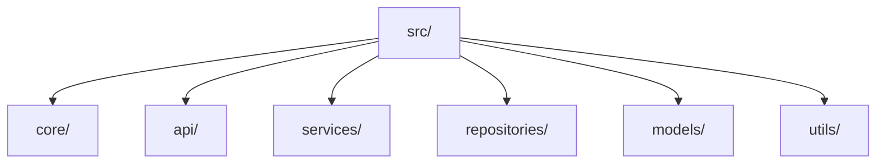

# Backend Step 3 — Python packages

## What you will do

Create the full layered `src/` package tree **in your editor**, then add
`__init__.py` markers so imports like `from src.core.settings import Settings`
work.

## Folders to create

From the **project root**, create these folders in your editor (or File Explorer):

```
src/
  core/
  api/
    routers/
    dependencies/
  services/
  repositories/
  models/
    dto/
    domain/
  utils/
```

Confirm in PowerShell if you like:

```powershell
Get-ChildItem -Recurse src -Directory | Select-Object FullName
```

## `__init__.py` files

Create these empty package marker files in your editor:

```
src/__init__.py
src/core/__init__.py
src/api/__init__.py
src/api/routers/__init__.py
src/api/dependencies/__init__.py
src/services/__init__.py
src/repositories/__init__.py
src/models/__init__.py
src/models/dto/__init__.py
src/models/domain/__init__.py
src/utils/__init__.py
```

### Type package markers

Open `src/__init__.py` and type:

```python
"""Nearest Grit Bin API package."""
```

Open `src/core/__init__.py` and type:

```python
"""Core package — settings, logging, and cross-cutting infrastructure."""
```

Leave the other `__init__.py` files empty (or add a one-line docstring if you prefer).
You will fill package exports in later steps where needed.

## Why this tree



Each folder is a **package**. Without `__init__.py`, Python may not treat the
folder as importable (depending on layout). We keep markers so
`from src.services.address_service import AddressService` always works.

> Primer: [00-python-fastapi-basics.md](./00-python-fastapi-basics.md) §1.  
> Design: [00-backend-design.md](./00-backend-design.md).

## Checkpoint

```powershell
.\.venv\Scripts\Activate.ps1
python -c "import src; print('ok')"
```

Should print `ok`.

---

<!-- tutorial-nav -->

| Previous | Next |
|:---------|-----:|
| ← [Backend env](./02-env.md) | [Config](./04-config.md) → |
