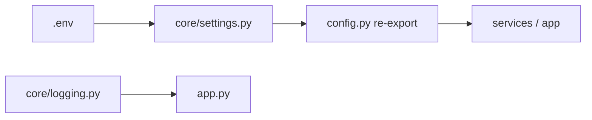

# Backend Step 4 — Config

## What you will do

1. Create the listed files in your editor.
2. Open each file and type the code carefully (or section by section).
3. Activate the venv and run the checkpoint before continuing.

Settings live in **`src/core/`** — infrastructure that every layer can import.
`src/config.py` is a thin **re-export** so callers can still write
`from src.config import get_settings`.



## File 1: `src/core/settings.py`

**Path:** `src/core/settings.py`

### Create this file in the editor

Create `src/core/settings.py` in your editor (from the project root), then type the contents below yourself.

### Purpose

Loads and validates environment variables. Builds Address API headers and the GeoServer WFS URL. Fails fast at startup if required keys are missing.

### Type this exactly

```python
"""Validated runtime settings loaded from environment variables."""

from __future__ import annotations

from functools import lru_cache

from pydantic import Field, field_validator
from pydantic_settings import BaseSettings, SettingsConfigDict


class Settings(BaseSettings):
    """Application settings.

    Missing required keys raise ValidationError at startup rather than failing
    later with an opaque HTTP 500 when an upstream call is made.
    """

    model_config = SettingsConfigDict(
        env_file=".env",
        env_file_encoding="utf-8",
        extra="ignore",
    )

    address_api_base_url: str = Field(..., alias="ADDRESS_API_BASE_URL")
    address_api_alias: str = Field(..., alias="ADDRESS_API_ALIAS")
    address_api_auth_token: str = Field(..., alias="ADDRESS_API_AUTH_TOKEN")

    geoserver_base_url: str = Field(..., alias="GEOSERVER_BASE_URL")
    geoserver_layer: str = Field(..., alias="GEOSERVER_LAYER")

    nearest_search_radius_meters: float = Field(
        100.0, alias="NEAREST_SEARCH_RADIUS_METERS"
    )
    http_timeout_seconds: float = Field(30.0, alias="HTTP_TIMEOUT_SECONDS")

    @field_validator(
        "address_api_base_url",
        "geoserver_base_url",
        mode="before",
    )
    @classmethod
    def strip_trailing_slash(cls, value: str) -> str:
        if isinstance(value, str):
            return value.rstrip("/")
        return value

    @property
    def address_api_headers(self) -> dict[str, str]:
        return {
            "x-alias": self.address_api_alias,
            "x-auth-token": self.address_api_auth_token,
            "Accept": "application/json",
        }

    @property
    def geoserver_wfs_url(self) -> str:
        """WFS GetFeature endpoint for the DCC workspace."""
        return f"{self.geoserver_base_url}/DCC/ows"


@lru_cache
def get_settings() -> Settings:
    """Cached settings singleton — load .env once per process."""
    return Settings()
```

---

## File 2: `src/core/logging.py`

**Path:** `src/core/logging.py`

### Create this file in the editor

Create `src/core/logging.py` in your editor (from the project root), then type the contents below yourself.

### Purpose

One place to configure root logging format and level. Called once from `app.py` at startup.

### Type this exactly

```python
"""Application logging configuration."""

from __future__ import annotations

import logging


def configure_logging(level: int = logging.INFO) -> None:
    """Configure root logging once for the process."""
    logging.basicConfig(
        level=level,
        format="%(asctime)s %(levelname)s [%(name)s] %(message)s",
        force=True,
    )
```

---

## File 3: `src/config.py`

**Path:** `src/config.py`

### Create this file in the editor

Create `src/config.py` in your editor (from the project root), then type the contents below yourself.

### Purpose

Public entry point for settings. Re-exports from `core.settings` so the rest of the app can import `from src.config import Settings, get_settings` without knowing about the `core/` package layout.

### Type this exactly

```python
"""Public configuration entrypoint.

Re-exports settings from ``core.settings`` so callers can use
``from src.config import Settings, get_settings``.
"""

from src.core.settings import Settings, get_settings

__all__ = ["Settings", "get_settings"]
```

### How the code works

| Concept | Where you see it | Plain meaning |
|---------|------------------|---------------|
| **Layering** | `core/settings.py` vs `config.py` | Core holds implementation; `config.py` is the stable public import path. |
| **`Field(...)`** | required fields | `...` means **required**. Defaults like `100.0` mean optional. |
| **`alias=`** | `alias="ADDRESS_API_BASE_URL"` | Maps UPPER_SNAKE env vars to `snake_case` Python names. |
| **`@property`** | `address_api_headers` | Computed values you read like attributes (`settings.geoserver_wfs_url`). |
| **`@lru_cache`** | `get_settings` | Load `.env` once; reuse the same `Settings` object. |

> New to classes and decorators? See [00-python-fastapi-basics.md](./00-python-fastapi-basics.md) §§3–5.  
> Design context: [00-backend-design.md](./00-backend-design.md).

## Checkpoint

```powershell
.\.venv\Scripts\Activate.ps1
python -c "from src.config import get_settings; print(get_settings().geoserver_wfs_url)"
```

You should see your GeoServer base URL with `/DCC/ows` appended.

---

<!-- tutorial-nav -->

| Previous | Next |
|:---------|-----:|
| ← [Init packages](./03-init-packages.md) | [Errors](./05-errors.md) → |
