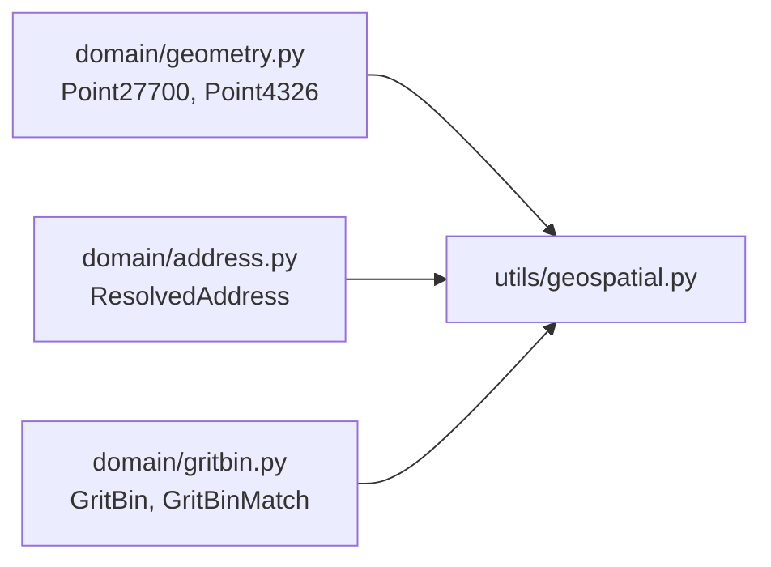

# Backend Step 6 — Domain geometry & geospatial helpers

## What you will do

1. Create five files with PowerShell (`New-Item`).
2. Open each file and type the code carefully (or section by section).
3. Activate the venv and run the checkpoint before continuing.

**Domain models** (`models/domain/`) are internal value objects — what your business
logic works with. **Geospatial helpers** (`utils/geospatial.py`) operate on those
points (CRS conversion, distance, nearest-feature selection).



---

## File 1: `src/models/domain/geometry.py`

**Path:** `src/models/domain/geometry.py`

### Create it in PowerShell (project root)

```powershell
New-Item -ItemType File -Force -Path src\models\domain\geometry.py | Out-Null
```

Open `src/models/domain/geometry.py` in your editor and type the contents below yourself.

### Type this exactly

```python
"""Coordinate geometry value objects."""

from __future__ import annotations

from dataclasses import dataclass


@dataclass(frozen=True, slots=True)
class Point27700:
    """A point in British National Grid metres (easting, northing)."""

    easting: float
    northing: float


@dataclass(frozen=True, slots=True)
class Point4326:
    """A point in WGS84 degrees (longitude, latitude) — always_xy order."""

    longitude: float
    latitude: float
```

---

## File 2: `src/models/domain/address.py`

**Path:** `src/models/domain/address.py`

### Create it in PowerShell (project root)

```powershell
New-Item -ItemType File -Force -Path src\models\domain\address.py | Out-Null
```

Open `src/models/domain/address.py` in your editor and type the contents below yourself.

### Type this exactly

```python
"""Address domain objects."""

from __future__ import annotations

from dataclasses import dataclass

from src.models.domain.geometry import Point27700


@dataclass(frozen=True, slots=True)
class ResolvedAddress:
    """Address match with coordinates normalised to EPSG:27700."""

    title: str
    postcode: str
    point: Point27700
```

---

## File 3: `src/models/domain/gritbin.py`

**Path:** `src/models/domain/gritbin.py`

### Create it in PowerShell (project root)

```powershell
New-Item -ItemType File -Force -Path src\models\domain\gritbin.py | Out-Null
```

Open `src/models/domain/gritbin.py` in your editor and type the contents below yourself.

### Type this exactly

```python
"""Grit-bin domain objects."""

from __future__ import annotations

from dataclasses import dataclass, field
from typing import Any

from src.models.domain.geometry import Point27700


@dataclass(frozen=True, slots=True)
class GritBin:
    """A grit-bin asset located in British National Grid."""

    title: str
    point: Point27700
    properties: dict[str, Any] = field(default_factory=dict)


@dataclass(frozen=True, slots=True)
class GritBinMatch:
    """Nearest grit bin relative to an origin point."""

    title: str
    distance_meters: float
    point: Point27700
    properties: dict[str, Any] = field(default_factory=dict)
```

---

## File 4: `src/models/domain/__init__.py`

**Path:** `src/models/domain/__init__.py`

### Create it in PowerShell (project root)

```powershell
New-Item -ItemType File -Force -Path src\models\domain\__init__.py | Out-Null
```

Open `src/models/domain/__init__.py` in your editor and type the contents below yourself.

### Type this exactly

```python
"""Domain models (entities and value objects)."""

from src.models.domain.address import ResolvedAddress
from src.models.domain.geometry import Point27700, Point4326
from src.models.domain.gritbin import GritBin, GritBinMatch

__all__ = [
    "GritBin",
    "GritBinMatch",
    "Point27700",
    "Point4326",
    "ResolvedAddress",
]
```

---

## File 5: `src/utils/geospatial.py`

**Path:** `src/utils/geospatial.py`

### Create it in PowerShell (project root)

```powershell
New-Item -ItemType File -Force -Path src\utils\geospatial.py | Out-Null
```

Open `src/utils/geospatial.py` in your editor and type the contents below yourself.

### Purpose

Converts between WGS84 (lat/lon) and British National Grid (EPSG:27700), computes planar distance in metres, and picks the nearest grit-bin feature from a GeoJSON list.

### Type this exactly

```python
"""Geospatial helpers: CRS conversion, planar distance, nearest-feature selection."""

from __future__ import annotations

import math
from typing import Any, Literal

from pyproj import Transformer

from src.models.domain.geometry import Point27700, Point4326
from src.models.domain.gritbin import GritBinMatch
from src.utils.exceptions import CoordinateConversionError, NoGritBinNearbyError

CrsCode = Literal["EPSG:27700", "EPSG:4326"]

_to_bng = Transformer.from_crs("EPSG:4326", "EPSG:27700", always_xy=True)
_to_wgs84 = Transformer.from_crs("EPSG:27700", "EPSG:4326", always_xy=True)


def lonlat_to_bng(longitude: float, latitude: float) -> Point27700:
    """Convert WGS84 lon/lat (EPSG:4326) → BNG easting/northing (EPSG:27700)."""
    try:
        easting, northing = _to_bng.transform(longitude, latitude)
    except Exception as exc:  # pragma: no cover
        raise CoordinateConversionError(str(exc)) from exc
    return Point27700(easting=float(easting), northing=float(northing))


def bng_to_lonlat(easting: float, northing: float) -> Point4326:
    """Convert BNG easting/northing (EPSG:27700) → WGS84 lon/lat (EPSG:4326)."""
    try:
        longitude, latitude = _to_wgs84.transform(easting, northing)
    except Exception as exc:  # pragma: no cover
        raise CoordinateConversionError(str(exc)) from exc
    return Point4326(longitude=float(longitude), latitude=float(latitude))


def ensure_bng(
    *,
    easting: float | None = None,
    northing: float | None = None,
    latitude: float | None = None,
    longitude: float | None = None,
) -> Point27700:
    """Return a BNG point from whichever coordinate pair is available."""
    if easting is not None and northing is not None:
        return Point27700(easting=float(easting), northing=float(northing))

    if latitude is not None and longitude is not None:
        return lonlat_to_bng(float(longitude), float(latitude))

    raise CoordinateConversionError(
        "Need either easting/northing or latitude/longitude."
    )


def euclidean_distance_meters(a: Point27700, b: Point27700) -> float:
    """Planar Euclidean distance in metres (valid for EPSG:27700)."""
    return math.hypot(a.easting - b.easting, a.northing - b.northing)


def detect_crs_from_values(x: float, y: float) -> CrsCode:
    """Heuristic CRS detection when the payload does not declare an SRS."""
    if -10.0 <= x <= 5.0 and 49.0 <= y <= 62.0:
        return "EPSG:4326"
    if 0.0 <= x <= 800_000 and -100_000 <= y <= 1_400_000:
        return "EPSG:27700"
    raise CoordinateConversionError(
        f"Unable to infer CRS for coordinates ({x}, {y})."
    )


def feature_title(feature: dict[str, Any]) -> str:
    props = feature.get("properties") or {}
    for key in ("Title", "title", "NAME", "name", "Subtitle"):
        if props.get(key):
            return str(props[key]).strip()
    return str(feature.get("id") or "unknown")


def feature_point(feature: dict[str, Any]) -> Point27700 | None:
    geometry = feature.get("geometry") or {}
    coords = geometry.get("coordinates")
    if (
        isinstance(coords, (list, tuple))
        and len(coords) >= 2
        and isinstance(coords[0], (int, float))
        and isinstance(coords[1], (int, float))
    ):
        return Point27700(easting=float(coords[0]), northing=float(coords[1]))
    return None


def nearest_from_features(
    features: list[dict[str, Any]],
    origin: Point27700,
    *,
    radius_meters: float,
) -> GritBinMatch:
    """Pick the closest grit bin within radius using planar Euclidean distance.

    Used as the DWITHIN fallback path and for ranking filtered candidates.
    """
    best: GritBinMatch | None = None

    for feature in features:
        point = feature_point(feature)
        if point is None:
            continue
        distance = euclidean_distance_meters(origin, point)
        if distance > radius_meters:
            continue
        if best is None or distance < best.distance_meters:
            best = GritBinMatch(
                title=feature_title(feature),
                distance_meters=distance,
                point=point,
                properties=dict(feature.get("properties") or {}),
            )

    if best is None:
        raise NoGritBinNearbyError(radius_meters)
    return best
```

### How the code works

1. Derbyshire GeoServer grit bins use **British National Grid** (EPSG:27700) — metres on the ground.
2. Some Address APIs return **lat/lon** degrees (EPSG:4326) instead.
3. `ensure_bng` normalises either flavour into a `Point27700`.
4. Distance is then simple Pythagoras (`math.hypot`) because BNG is already in metres.
5. `nearest_from_features` ranks raw GeoJSON features — reused by the grit-bin service fallback path.

> Why domain models? A bare `(440000, 355000)` is easy to misuse. A `Point27700` object documents what the numbers mean. Primer: [00-python-fastapi-basics.md](./00-python-fastapi-basics.md) §4.

## Checkpoint

```powershell
.\.venv\Scripts\Activate.ps1
python -c "from src.utils.geospatial import euclidean_distance_meters as d; from src.models.domain.geometry import Point27700 as P; print(d(P(0,0), P(3,4)))"
```

Expected: `5.0`

---

<!-- tutorial-nav -->

| Previous | Next |
|:---------|-----:|
| ← [Errors](./05-errors.md) | [Address service](./07-address-service.md) → |
