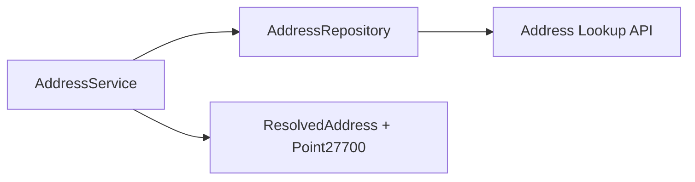

# Backend Step 7 — Address repository & service

## What you will do

1. Create the listed files in your editor.
2. Open each file and type the code carefully (or section by section).
3. Activate the venv and run the checkpoint before continuing.

This step splits address lookup into two layers:

| Layer | Module | Responsibility |
|-------|--------|----------------|
| **Repository** | `address_repository.py` | HTTP only — fetch raw JSON from the Address Lookup API |
| **Service** | `address_service.py` | Business rules — title matching, coordinate extraction, no FastAPI |

Neither file imports FastAPI. That keeps them easy to unit-test in isolation.



---

## File 1: `src/repositories/address_repository.py`

**Path:** `src/repositories/address_repository.py`

### Create this file in the editor

Create `src/repositories/address_repository.py` in your editor (from the project root), then type the contents below yourself.

### Purpose

Fetches raw address records from the Derbyshire Address Lookup API. Raises typed errors on transport or schema failure. No matching logic here.

### Type this exactly

```python
"""Address Lookup API data access (HTTP only — no business rules)."""

from __future__ import annotations

import logging
from typing import Any
from urllib.parse import quote

import httpx

from src.core.settings import Settings
from src.utils.exceptions import (
    AddressApiUnreachableError,
    AddressNotFoundError,
    UnexpectedSchemaError,
)

logger = logging.getLogger(__name__)


def unwrap_address_list(payload: Any) -> list[dict[str, Any]]:
    """Accept list, or common envelope shapes: {results|addresses|data|Items: [...]}."""
    if isinstance(payload, list):
        records = payload
    elif isinstance(payload, dict):
        for key in (
            "results",
            "Results",
            "addresses",
            "Addresses",
            "data",
            "Data",
            "Items",
            "items",
        ):
            if key in payload and isinstance(payload[key], list):
                records = payload[key]
                break
        else:
            records = [payload]
    else:
        raise UnexpectedSchemaError(
            "Address API",
            detail=f"Expected list or object, got {type(payload).__name__}.",
        )

    if not all(isinstance(item, dict) for item in records):
        raise UnexpectedSchemaError(
            "Address API",
            detail="Address list contains non-object entries.",
        )
    return records  # type: ignore[return-value]


class AddressRepository:
    """Fetches raw address records from the Derbyshire Address Lookup API."""

    def __init__(self, settings: Settings, client: httpx.AsyncClient) -> None:
        self._settings = settings
        self._client = client

    async def fetch_by_postcode(self, postcode: str) -> list[dict[str, Any]]:
        """GET addresses for a postcode. Raises typed errors on transport/schema failure."""
        encoded = quote(postcode.strip(), safe="")
        url = f"{self._settings.address_api_base_url}/{encoded}"

        try:
            response = await self._client.get(
                url,
                headers=self._settings.address_api_headers,
            )
        except httpx.RequestError as exc:
            logger.warning("Address API request failed: %s", exc)
            raise AddressApiUnreachableError(str(exc)) from exc

        if response.status_code >= 500:
            raise AddressApiUnreachableError(f"HTTP {response.status_code}")
        if response.status_code == 404:
            raise AddressNotFoundError(postcode)
        if response.status_code >= 400:
            raise AddressApiUnreachableError(
                f"HTTP {response.status_code}: {response.text[:200]}"
            )

        try:
            payload = response.json()
        except ValueError as exc:
            raise UnexpectedSchemaError(
                "Address API", detail="Response was not valid JSON."
            ) from exc

        records = unwrap_address_list(payload)
        if not records:
            raise AddressNotFoundError(postcode)
        return records
```

---

## File 2: `src/services/address_service.py`

**Path:** `src/services/address_service.py`

### Create this file in the editor

Create `src/services/address_service.py` in your editor (from the project root), then type the contents below yourself.

### Purpose

Resolves a postcode + address hint to a `ResolvedAddress` with a BNG point. Uses the repository for HTTP; owns all matching and coordinate extraction logic.

### Type this exactly

```python
"""Address resolution business logic (no FastAPI imports)."""

from __future__ import annotations

from typing import Any

import httpx

from src.core.settings import Settings
from src.models.domain.address import ResolvedAddress
from src.repositories.address_repository import AddressRepository
from src.utils.exceptions import TargetAddressNotFoundError, UnexpectedSchemaError
from src.utils.geospatial import ensure_bng

_TITLE_KEYS = (
    "Title",
    "title",
    "Address",
    "address",
    "FullAddress",
    "fullAddress",
    "AddressLine",
)

_MATCH_PART_KEYS = (
    "BuildingName",
    "SubBuildingName",
    "BuildingNumber",
    "OrganisationName",
    "DepartmentName",
    "DependentThoroughfareName",
    "ThoroughFareName",
    "DependentLocality",
    "DoubleDependentLocality",
    "PostTown",
)

_EASTING_KEYS = (
    "Easting",
    "Eastings",
    "easting",
    "X_COORDINATE",
    "x",
    "X",
    "EastingCoordinate",
)
_NORTHING_KEYS = (
    "Northing",
    "Northings",
    "northing",
    "Y_COORDINATE",
    "y",
    "Y",
    "NorthingCoordinate",
)
_LAT_KEYS = ("Latitude", "latitude", "lat", "Lat")
_LON_KEYS = ("Longitude", "longitude", "lon", "Lng", "lng", "Long")


def _first_present(record: dict[str, Any], keys: tuple[str, ...]) -> Any | None:
    for key in keys:
        if key in record and record[key] is not None and record[key] != "":
            return record[key]
    return None


def _as_float(value: Any) -> float | None:
    try:
        return float(value)
    except (TypeError, ValueError):
        return None


def _compose_title(record: dict[str, Any]) -> str | None:
    explicit = _first_present(record, _TITLE_KEYS)
    if explicit is not None:
        return str(explicit).strip()

    parts: list[str] = []
    for key in _MATCH_PART_KEYS:
        value = record.get(key)
        if value is not None and str(value).strip():
            parts.append(str(value).strip())

    postcode = record.get("PostCode") or record.get("Postcode") or record.get("postcode")
    if postcode and str(postcode).strip():
        parts.append(str(postcode).strip())

    return ", ".join(parts) if parts else None


def _matchable_text(record: dict[str, Any]) -> str:
    chunks: list[str] = []
    title = _compose_title(record)
    if title:
        chunks.append(title)
    for key in _MATCH_PART_KEYS + _TITLE_KEYS:
        value = record.get(key)
        if value is not None and str(value).strip():
            chunks.append(str(value).strip())
    return " ".join(chunks).upper()


def _extract_point(record: dict[str, Any]):
    nested = (
        record.get("SpatialFeature")
        or record.get("spatialFeature")
        or record.get("location")
        or record.get("Location")
        or record.get("Coordinates")
    )
    search_space: dict[str, Any] = dict(record)
    if isinstance(nested, dict):
        search_space.update(nested)

    easting = _as_float(_first_present(search_space, _EASTING_KEYS))
    northing = _as_float(_first_present(search_space, _NORTHING_KEYS))
    latitude = _as_float(_first_present(search_space, _LAT_KEYS))
    longitude = _as_float(_first_present(search_space, _LON_KEYS))

    try:
        return ensure_bng(
            easting=easting,
            northing=northing,
            latitude=latitude,
            longitude=longitude,
        )
    except Exception as exc:
        raise UnexpectedSchemaError(
            "Address API",
            detail=f"Could not extract coordinates: {exc}",
        ) from exc


def find_matching_address(
    records: list[dict[str, Any]],
    *,
    address: str,
    postcode: str,
) -> ResolvedAddress:
    """Find the first record whose address text contains ``address`` (case-insensitive)."""
    needle = address.strip().upper()
    if not needle:
        raise TargetAddressNotFoundError(address, postcode)

    for record in records:
        if needle not in _matchable_text(record):
            continue
        title = _compose_title(record)
        if title is None:
            continue
        point = _extract_point(record)
        return ResolvedAddress(title=title, postcode=postcode, point=point)

    raise TargetAddressNotFoundError(address, postcode)


class AddressService:
    """Resolves a postcode + address hint to a BNG point."""

    def __init__(
        self,
        settings: Settings,
        client: httpx.AsyncClient | None = None,
        *,
        repository: AddressRepository | None = None,
    ) -> None:
        self._settings = settings
        self._client = client
        self._owns_client = client is None and repository is None
        self._repository = repository

    async def __aenter__(self) -> AddressService:
        if self._repository is None:
            if self._client is None:
                self._client = httpx.AsyncClient(
                    timeout=self._settings.http_timeout_seconds
                )
            self._repository = AddressRepository(self._settings, self._client)
        return self

    async def __aexit__(self, *exc: object) -> None:
        if self._owns_client and self._client is not None:
            await self._client.aclose()

    def _repo(self) -> AddressRepository:
        if self._repository is None:
            if self._client is None:
                raise RuntimeError(
                    "AddressService requires an httpx client or repository."
                )
            self._repository = AddressRepository(self._settings, self._client)
        return self._repository

    async def lookup_postcode(self, postcode: str) -> list[dict[str, Any]]:
        return await self._repo().fetch_by_postcode(postcode)

    async def resolve_address(self, *, postcode: str, address: str) -> ResolvedAddress:
        records = await self.lookup_postcode(postcode)
        return find_matching_address(records, address=address, postcode=postcode)
```

### How the code works

#### Mental model

```
AddressService
   │
   ├─ lookup_postcode(postcode)     → list of raw address dicts (via repository)
   └─ resolve_address(postcode, address)
         │
         ├─ lookup_postcode(...)
         └─ find_matching_address(...)  → ResolvedAddress (title + BNG point)
```

#### What the code is doing

1. **Repository** builds URL `{ADDRESS_API_BASE_URL}/{postcode}` and returns raw JSON records.
2. **Service** finds the first record whose text contains your address hint (e.g. `Example Building`).
3. Coordinates are extracted (even nested under `SpatialFeature`) and normalised to BNG via `ensure_bng`.
4. Returns a `ResolvedAddress` ready for the grit-bin step.

| Concept | Where | Plain meaning |
|---------|-------|---------------|
| **Repository** | `AddressRepository` | One external system, HTTP only |
| **Service** | `AddressService` | Domain rules on top of the repository |
| **`async def` / `await`** | `lookup_postcode`, `resolve_address` | Network calls pause so the server can handle other requests |
| **Helper functions** | `_compose_title`, `find_matching_address` | Module-level logic that does not need `self` |

> Async primer: [00-python-fastapi-basics.md](./00-python-fastapi-basics.md) §6.

## Checkpoint

```powershell
.\.venv\Scripts\Activate.ps1
python -c "from src.services.address_service import find_matching_address as f; r=f([{'BuildingName':'Example Building','Eastings':'440000','Northings':'355000'}], address='hillbrow', postcode='AB12 3CD'); print(r.title, r.point)"
```

Should print a title containing Example Building and a `Point27700`.

---

<!-- tutorial-nav -->

| Previous | Next |
|:---------|-----:|
| ← [Coordinates](./06-coordinates.md) | [Grit-bin service](./08-geoserver-service.md) → |
