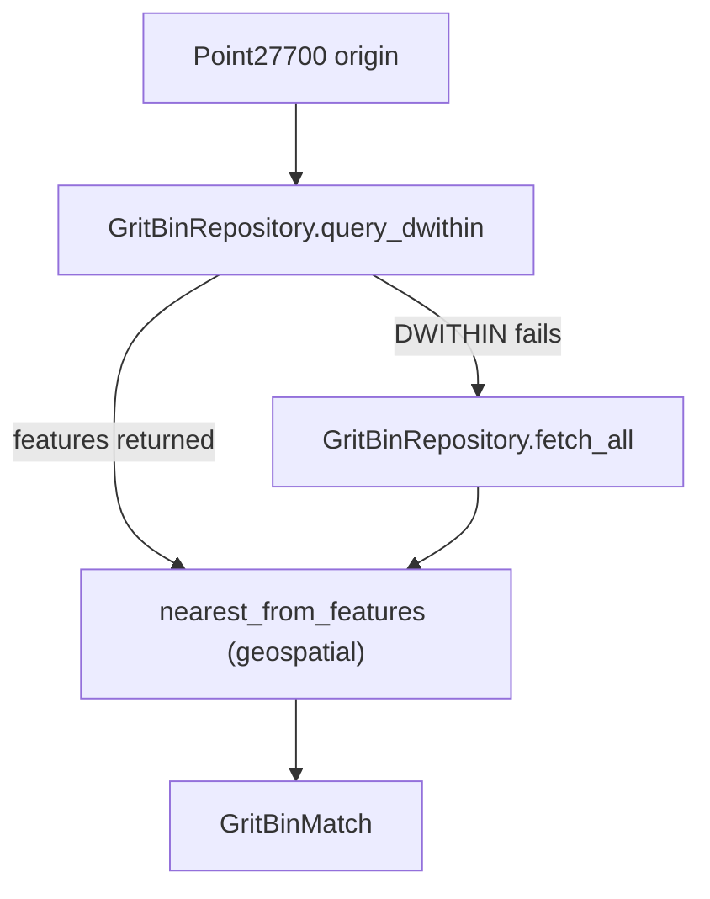

# Backend Step 8 — Grit-bin repository, service & DTOs

## What you will do

1. Create the listed files in your editor.
2. Open each file and type the code carefully (or section by section).
3. Activate the venv and run the checkpoint before continuing.

This step adds the **grit-bin domain** (replacing the old monolithic GeoServer service).
The filename stays `08-geoserver-service.md` for tutorial navigation stability, but the
code lives in `gritbin_repository.py`, `gritbin_service.py`, and `models/dto/`.

| Layer | Module | Responsibility |
|-------|--------|----------------|
| **Repository** | `gritbin_repository.py` | WFS HTTP only — DWITHIN query or full fetch |
| **Service** | `gritbin_service.py` | Business rules — fallback + nearest selection |
| **DTOs** | `models/dto/*` | Pydantic shapes for OpenAPI / JSON responses |



---

## File 1: `src/repositories/gritbin_repository.py`

**Path:** `src/repositories/gritbin_repository.py`

### Create this file in the editor

Create `src/repositories/gritbin_repository.py` in your editor (from the project root), then type the contents below yourself.

### Purpose

Fetches grit-bin GeoJSON features from Derbyshire GeoServer WFS. HTTP only — no distance maths here.

### Type this exactly

```python
"""GeoServer WFS data access for grit-bin features (HTTP only)."""

from __future__ import annotations

import logging
from typing import Any

import httpx

from src.core.settings import Settings
from src.models.domain.geometry import Point27700
from src.utils.exceptions import GeoServerUnreachableError, UnexpectedSchemaError

logger = logging.getLogger(__name__)

GEOMETRY_FIELD = "SP_GEOMETRY"


def parse_feature_collection(payload: Any) -> list[dict[str, Any]]:
    if not isinstance(payload, dict):
        raise UnexpectedSchemaError(
            "GeoServer",
            detail=f"Expected GeoJSON object, got {type(payload).__name__}.",
        )
    if "ExceptionReport" in payload or payload.get("type") == "Exception":
        raise UnexpectedSchemaError("GeoServer", detail="Received OGC exception.")

    features = payload.get("features")
    if features is None:
        raise UnexpectedSchemaError(
            "GeoServer", detail="Missing 'features' array in GeoJSON."
        )
    if not isinstance(features, list):
        raise UnexpectedSchemaError("GeoServer", detail="'features' was not a list.")
    return features


class GritBinRepository:
    """Fetches grit-bin GeoJSON features from Derbyshire GeoServer WFS."""

    def __init__(self, settings: Settings, client: httpx.AsyncClient) -> None:
        self._settings = settings
        self._client = client

    def _base_params(self) -> dict[str, str]:
        return {
            "service": "WFS",
            "version": "1.0.0",
            "request": "GetFeature",
            "typeName": self._settings.geoserver_layer,
            "outputFormat": "application/json",
        }

    async def _get_features(self, params: dict[str, str]) -> list[dict[str, Any]]:
        try:
            response = await self._client.get(
                self._settings.geoserver_wfs_url,
                params=params,
            )
        except httpx.RequestError as exc:
            logger.warning("GeoServer request failed: %s", exc)
            raise GeoServerUnreachableError(str(exc)) from exc

        content_type = response.headers.get("content-type", "")
        if response.status_code >= 400:
            raise GeoServerUnreachableError(f"HTTP {response.status_code}")

        body_preview = response.text[:200].lstrip()
        if "ExceptionReport" in body_preview or (
            "xml" in content_type.lower() and "json" not in content_type.lower()
        ):
            raise UnexpectedSchemaError(
                "GeoServer",
                detail=body_preview[:160],
            )

        try:
            payload = response.json()
        except ValueError as exc:
            raise UnexpectedSchemaError(
                "GeoServer", detail="Response was not valid JSON."
            ) from exc

        return parse_feature_collection(payload)

    async def query_dwithin(
        self,
        origin: Point27700,
        *,
        radius_meters: float,
    ) -> list[dict[str, Any]]:
        """Spatial filter via CQL DWITHIN around the origin point."""
        cql = (
            f"DWITHIN({GEOMETRY_FIELD}, "
            f"POINT({origin.easting} {origin.northing}), "
            f"{radius_meters}, meters)"
        )
        params = {**self._base_params(), "CQL_FILTER": cql}
        return await self._get_features(params)

    async def fetch_all(self) -> list[dict[str, Any]]:
        """Unfiltered GetFeature — used only as a DWITHIN fallback."""
        return await self._get_features(self._base_params())
```

---

## File 2: `src/services/gritbin_service.py`

**Path:** `src/services/gritbin_service.py`

### Create this file in the editor

Create `src/services/gritbin_service.py` in your editor (from the project root), then type the contents below yourself.

### Purpose

Finds the nearest grit bin within a radius. Tries CQL `DWITHIN` first; falls back to full fetch + Euclidean distance via `nearest_from_features`.

### Type this exactly

```python
"""Grit-bin proximity business logic (no FastAPI imports)."""

from __future__ import annotations

import logging

import httpx

from src.core.settings import Settings
from src.models.domain.geometry import Point27700
from src.models.domain.gritbin import GritBinMatch
from src.repositories.gritbin_repository import GritBinRepository
from src.utils.exceptions import (
    GeoServerUnreachableError,
    NoGritBinNearbyError,
    UnexpectedSchemaError,
)
from src.utils.geospatial import nearest_from_features

logger = logging.getLogger(__name__)


class GritBinService:
    """Finds the nearest grit bin within a radius (DWITHIN + Euclidean fallback)."""

    def __init__(
        self,
        settings: Settings,
        client: httpx.AsyncClient | None = None,
        *,
        repository: GritBinRepository | None = None,
    ) -> None:
        self._settings = settings
        self._client = client
        self._owns_client = client is None and repository is None
        self._repository = repository

    async def __aenter__(self) -> GritBinService:
        if self._repository is None:
            if self._client is None:
                self._client = httpx.AsyncClient(
                    timeout=self._settings.http_timeout_seconds
                )
            self._repository = GritBinRepository(self._settings, self._client)
        return self

    async def __aexit__(self, *exc: object) -> None:
        if self._owns_client and self._client is not None:
            await self._client.aclose()

    def _repo(self) -> GritBinRepository:
        if self._repository is None:
            if self._client is None:
                raise RuntimeError(
                    "GritBinService requires an httpx client or repository."
                )
            self._repository = GritBinRepository(self._settings, self._client)
        return self._repository

    async def find_nearest(
        self,
        origin: Point27700,
        *,
        radius_meters: float | None = None,
    ) -> GritBinMatch:
        """Nearest grit bin within radius; DWITHIN first, Euclidean fallback."""
        radius = (
            radius_meters
            if radius_meters is not None
            else self._settings.nearest_search_radius_meters
        )
        repo = self._repo()

        features: list | None = None
        try:
            features = await repo.query_dwithin(origin, radius_meters=radius)
            logger.info("DWITHIN returned %d feature(s)", len(features))
        except (GeoServerUnreachableError, UnexpectedSchemaError) as exc:
            logger.warning(
                "DWITHIN failed (%s); falling back to full fetch + Euclidean distance",
                exc,
            )
            features = await repo.fetch_all()

        if not features:
            logger.info("DWITHIN empty; attempting full-layer Euclidean fallback")
            try:
                features = await repo.fetch_all()
            except (GeoServerUnreachableError, UnexpectedSchemaError):
                raise NoGritBinNearbyError(radius) from None

        return nearest_from_features(features, origin, radius_meters=radius)
```

---

## File 3: `src/models/dto/gritbin.py`

**Path:** `src/models/dto/gritbin.py`

### Create this file in the editor

Create `src/models/dto/gritbin.py` in your editor (from the project root), then type the contents below yourself.

### Type this exactly

```python
"""HTTP request/response DTOs for grit-bin endpoints."""

from __future__ import annotations

from pydantic import BaseModel, Field


class NearestGritBinResponse(BaseModel):
    """Contractual response shape for the technical exercise."""

    address: str
    postcode: str
    nearest_grit_bin_title: str
    distance_meters: float = Field(
        ...,
        description="Planar distance in metres (EPSG:27700).",
    )
```

---

## File 4: `src/models/dto/address.py`

**Path:** `src/models/dto/address.py`

### Create this file in the editor

Create `src/models/dto/address.py` in your editor (from the project root), then type the contents below yourself.

### Type this exactly

```python
"""HTTP request/response DTOs for address / meta endpoints."""

from __future__ import annotations

from typing import Any

from pydantic import BaseModel


class HealthResponse(BaseModel):
    status: str


class RootResponse(BaseModel):
    service: str
    docs: str
    endpoint: str
    extras: dict[str, Any] | None = None
```

---

## File 5: `src/models/dto/__init__.py`

**Path:** `src/models/dto/__init__.py`

### Create this file in the editor

Create `src/models/dto/__init__.py` in your editor (from the project root), then type the contents below yourself.

### Type this exactly

```python
"""Pydantic DTOs for the HTTP API boundary."""

from src.models.dto.address import HealthResponse, RootResponse
from src.models.dto.gritbin import NearestGritBinResponse

__all__ = ["HealthResponse", "NearestGritBinResponse", "RootResponse"]
```

### How the code works

#### What `DWITHIN` means

It is a spatial filter (CQL) saying: “return features whose geometry is within
*radius* metres of this point.” When GeoServer supports it, that is the efficient path.
When it does not, the service downloads all features and ranks them with
`nearest_from_features` in `utils/geospatial.py`.

#### Domain vs DTO

- **Domain** (`GritBinMatch`) — what services return internally.
- **DTO** (`NearestGritBinResponse`) — what FastAPI serialises to JSON for clients.

> Exceptions primer: [00-python-fastapi-basics.md](./00-python-fastapi-basics.md) §7.  
> Spatial deep dive: [../10-spatial-querying.md](../10-spatial-querying.md).

## Checkpoint

```powershell
.\.venv\Scripts\Activate.ps1
python -c "from src.utils.geospatial import nearest_from_features as n; from src.models.domain.geometry import Point27700 as P; f=[{'properties':{'Title':'GB0199'},'geometry':{'coordinates':[440010,355000]}}]; m=n(f, P(440000,355000), radius_meters=100); print(m.title, round(m.distance_meters,2))"
```

Expected: `GB0199 10.0`

---

<!-- tutorial-nav -->

| Previous | Next |
|:---------|-----:|
| ← [Address service](./07-address-service.md) | [FastAPI app](./09-app.md) → |
