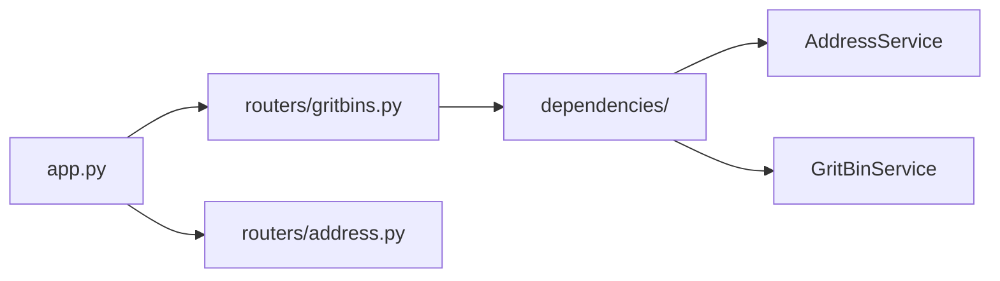

# Backend Step 9 — FastAPI app, routers & dependencies

## What you will do

1. Create six files with PowerShell (`New-Item`).
2. Open each file and type the code carefully (or section by section).
3. Activate the venv and run the checkpoint before continuing.

The HTTP layer is thin: routers validate query params and delegate to services.
Dependencies wire settings and the shared `httpx` client into those services.



---

## File 1: `src/api/dependencies/__init__.py`

**Path:** `src/api/dependencies/__init__.py`

### Create it in PowerShell (project root)

```powershell
New-Item -ItemType File -Force -Path src\api\dependencies\__init__.py | Out-Null
```

Open `src/api/dependencies/__init__.py` in your editor and type the contents below yourself.

### Purpose

FastAPI `Depends(...)` providers for settings, the shared HTTP client, and service instances.

### Type this exactly

```python
"""FastAPI dependency providers (settings, HTTP client, services)."""

from __future__ import annotations

import httpx
from fastapi import Request

from src.config import Settings, get_settings
from src.services.address_service import AddressService
from src.services.gritbin_service import GritBinService


def provide_settings() -> Settings:
    return get_settings()


def provide_http_client(request: Request) -> httpx.AsyncClient:
    return request.app.state.http_client


def provide_address_service(
    request: Request,
) -> AddressService:
    settings: Settings = request.app.state.settings
    client: httpx.AsyncClient = request.app.state.http_client
    return AddressService(settings, client=client)


def provide_gritbin_service(
    request: Request,
) -> GritBinService:
    settings: Settings = request.app.state.settings
    client: httpx.AsyncClient = request.app.state.http_client
    return GritBinService(settings, client=client)
```

---

## File 2: `src/api/routers/address.py`

**Path:** `src/api/routers/address.py`

### Create it in PowerShell (project root)

```powershell
New-Item -ItemType File -Force -Path src\api\routers\address.py | Out-Null
```

Open `src/api/routers/address.py` in your editor and type the contents below yourself.

### Purpose

Meta / health routes. Keeps system endpoints separate from grit-bin business routes.

### Type this exactly

```python
"""Meta / health routes (address domain boundary for future address endpoints)."""

from __future__ import annotations

from typing import Any

from fastapi import APIRouter

from src.models.dto.address import HealthResponse

router = APIRouter(tags=["system"])


@router.get("/health", response_model=HealthResponse)
async def health() -> HealthResponse:
    return HealthResponse(status="ok")


@router.get("/")
async def root() -> dict[str, Any]:
    return {
        "service": "nearest-grit-bin",
        "docs": "/docs",
        "endpoint": "/nearest-grit-bin?postcode=DE55%205PB&address=HILLBROW",
    }
```

---

## File 3: `src/api/routers/gritbins.py`

**Path:** `src/api/routers/gritbins.py`

### Create it in PowerShell (project root)

```powershell
New-Item -ItemType File -Force -Path src\api\routers\gritbins.py | Out-Null
```

Open `src/api/routers/gritbins.py` in your editor and type the contents below yourself.

### Purpose

`GET /nearest-grit-bin` — the main endpoint. Resolves the address, finds the nearest grit bin, returns a DTO.

### Type this exactly

```python
"""Grit-bin HTTP routes — request/response only."""

from __future__ import annotations

from fastapi import APIRouter, Depends, Query

from src.api.dependencies import provide_address_service, provide_gritbin_service
from src.models.dto.gritbin import NearestGritBinResponse
from src.services.address_service import AddressService
from src.services.gritbin_service import GritBinService
from src.utils.exceptions import MissingParameterError

router = APIRouter(tags=["gritbins"])


@router.get(
    "/nearest-grit-bin",
    response_model=NearestGritBinResponse,
    responses={
        400: {"description": "Missing or invalid parameters"},
        404: {"description": "Address or grit bin not found"},
        502: {"description": "Upstream Address API or GeoServer failure"},
    },
)
async def nearest_grit_bin(
    postcode: str | None = Query(
        default=None,
        description="UK postcode, e.g. DE55 5PB",
        examples=["DE55 5PB"],
    ),
    address: str | None = Query(
        default=None,
        description="Substring matched against address Title, e.g. HILLBROW",
        examples=["HILLBROW"],
    ),
    address_service: AddressService = Depends(provide_address_service),
    gritbin_service: GritBinService = Depends(provide_gritbin_service),
) -> NearestGritBinResponse:
    """Locate the nearest grit bin within the configured search radius."""
    if not postcode or not postcode.strip():
        raise MissingParameterError("postcode")
    if not address or not address.strip():
        raise MissingParameterError("address")

    resolved = await address_service.resolve_address(
        postcode=postcode.strip(),
        address=address.strip(),
    )
    match = await gritbin_service.find_nearest(resolved.point)

    return NearestGritBinResponse(
        address=address.strip(),
        postcode=postcode.strip().upper(),
        nearest_grit_bin_title=match.title,
        distance_meters=round(match.distance_meters, 2),
    )
```

---

## File 4: `src/app.py`

**Path:** `src/app.py`

### Create it in PowerShell (project root)

```powershell
New-Item -ItemType File -Force -Path src\app.py | Out-Null
```

Open `src/app.py` in your editor and type the contents below yourself.

### Purpose

Application factory: lifespan (shared `httpx` client), `AppError` handler, router registration.

### Type this exactly

```python
"""FastAPI application factory and ASGI app instance."""

from __future__ import annotations

import logging
from contextlib import asynccontextmanager

import httpx
from dotenv import load_dotenv
from fastapi import FastAPI, Request
from fastapi.responses import JSONResponse

from src.api.routers import address as address_router
from src.api.routers import gritbins as gritbins_router
from src.config import get_settings
from src.core.logging import configure_logging
from src.utils.exceptions import AppError

logger = logging.getLogger(__name__)


@asynccontextmanager
async def lifespan(app: FastAPI):
    """Share one httpx client across requests for connection pooling."""
    settings = get_settings()
    async with httpx.AsyncClient(timeout=settings.http_timeout_seconds) as client:
        app.state.settings = settings
        app.state.http_client = client
        logger.info("Application started — config loaded from environment")
        yield
    logger.info("Application shutdown")


def create_app() -> FastAPI:
    """Build and return the FastAPI application (testable factory)."""
    load_dotenv()
    configure_logging()

    application = FastAPI(
        title="Nearest Grit Bin API",
        description=(
            "Finds the nearest Derbyshire County Council grit bin to a given "
            "address within a postcode, using the Address Lookup API and GeoServer WFS."
        ),
        version="1.0.0",
        lifespan=lifespan,
    )

    @application.exception_handler(AppError)
    async def app_error_handler(_request: Request, exc: AppError) -> JSONResponse:
        return JSONResponse(
            status_code=exc.status_code,
            content={"error": {"code": exc.code, "message": exc.message}},
        )

    application.include_router(address_router.router)
    application.include_router(gritbins_router.router)
    return application


app = create_app()
```

---

## File 5: `src/main.py`

**Path:** `src/main.py`

### Create it in PowerShell (project root)

```powershell
New-Item -ItemType File -Force -Path src\main.py | Out-Null
```

Open `src/main.py` in your editor and type the contents below yourself.

### Purpose

Process entrypoint — optional alternative to running uvicorn directly.

### Type this exactly

```python
"""Process entrypoint — starts uvicorn with the FastAPI app.

Prefer:
  uvicorn src.app:app --reload --host 0.0.0.0 --port 8000

Or:
  python -m src.main
"""

from __future__ import annotations

import uvicorn

from src.app import app

__all__ = ["app"]


def run() -> None:
    uvicorn.run(
        "src.app:app",
        host="0.0.0.0",
        port=8000,
        reload=False,
    )


if __name__ == "__main__":
    run()
```

### How the code works

#### Request flow

```
GET /nearest-grit-bin?postcode=…&address=…
   │
   ├─ gritbins router validates params (MissingParameterError if blank)
   ├─ Depends → AddressService.resolve_address → ResolvedAddress
   ├─ Depends → GritBinService.find_nearest → GritBinMatch
   └─ NearestGritBinResponse → JSON
```

#### Error JSON shape

Any `AppError` subclass becomes:

```json
{ "error": { "code": "target_address_not_found", "message": "…" } }
```

#### Why one shared `httpx.AsyncClient`?

Creating a new HTTP client per request is slow (new connections every time).
The lifespan stores **one** client on `app.state` and both services reuse it
(connection pooling).

> FastAPI primer: [00-python-fastapi-basics.md](./00-python-fastapi-basics.md) §§8–9.

## Checkpoint

Syntax-check only for now:

```powershell
.\.venv\Scripts\Activate.ps1
python -c "from src.app import app; print(app.title)"
```

Expected: `Nearest Grit Bin API`

---

<!-- tutorial-nav -->

| Previous | Next |
|:---------|-----:|
| ← [Grit-bin service](./08-geoserver-service.md) | [Backend run and test](./10-run-and-test.md) → |
