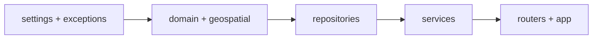

# Backend lab (FastAPI)

Type these files **in order**. Each step is one lesson file.

Work from your **project root** (the folder that will contain `src/`, `.env`, and
`requirements.txt`).

## Layered design (read first)

→ **[00-backend-design.md](./00-backend-design.md)** — Mermaid diagrams + layer rules

## New to Python or FastAPI?

→ **[00-python-fastapi-basics.md](./00-python-fastapi-basics.md)**

Later steps also explain concepts **inline** where they first appear.

## TYPE THESE FILES IN ORDER

| Step | Lesson file | You create |
|-----:|-------------|------------|
| 0a | [00-backend-design.md](./00-backend-design.md) | *(read only — architecture)* |
| 0b | [00-python-fastapi-basics.md](./00-python-fastapi-basics.md) | *(read only — primer)* |
| 1 | [01-requirements.md](./01-requirements.md) | `requirements.txt`, `requirements-dev.txt`, venv |
| 2 | [02-env.md](./02-env.md) | `.env.example`, `.env` |
| 3 | [03-init-packages.md](./03-init-packages.md) | Full `src/` package tree + `__init__.py` |
| 4 | [04-config.md](./04-config.md) | `core/settings.py`, `core/logging.py`, `config.py` |
| 5 | [05-errors.md](./05-errors.md) | `utils/exceptions.py` |
| 6 | [06-coordinates.md](./06-coordinates.md) | `models/domain/*` + `utils/geospatial.py` |
| 7 | [07-address-service.md](./07-address-service.md) | address repository + service |
| 8 | [08-geoserver-service.md](./08-geoserver-service.md) | gritbin repository + service + DTO |
| 9 | [09-app.md](./09-app.md) | dependencies, routers, `app.py`, `main.py` |
| 10 | [10-run-and-test.md](./10-run-and-test.md) | Run uvicorn + hit `/docs` |



## Before you start

In **PowerShell**, create a project folder (or open an empty folder you already
have) and go into it:

```powershell
Set-Location $HOME\Cursor_AI_projects   # or any folder you prefer
# Create grit-bin-lab in your editor or File Explorer, then:
Set-Location grit-bin-lab
```

Open that folder in your editor, and keep PowerShell at the **project root** for
every later command.

**Workflow:** create each file in the editor → **type** the code → PowerShell runs
the checkpoint.

Then open **[00-backend-design.md](./00-backend-design.md)**.

---

<!-- tutorial-nav -->

| Previous | Next |
|:---------|-----:|
| ← [Environment variables](../04-environment-variables.md) | [Backend design](./00-backend-design.md) → |
